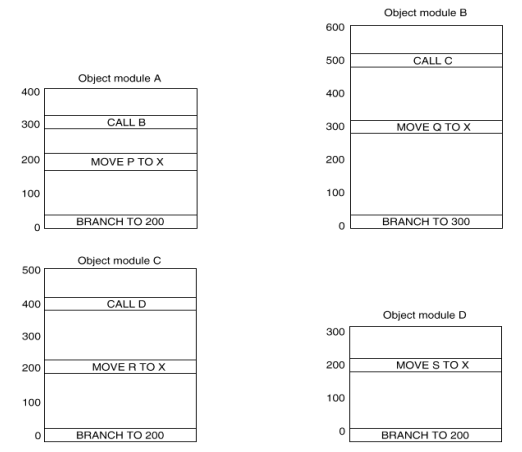
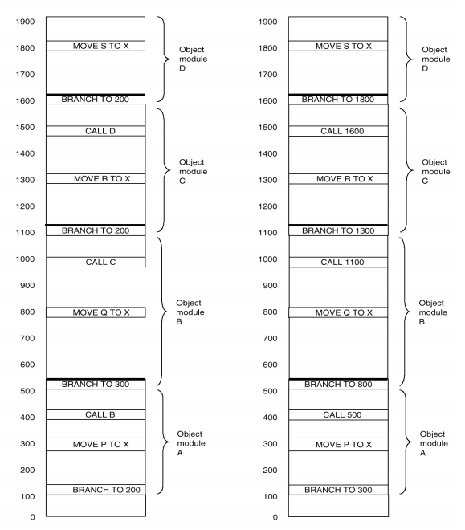

# Trabalho Prático 2 - Ligador

## 1. Descrição Geral

Este trabalho envolve a implementação de um editor de ligação, ou ligador, que seja capaz de receber módulos objeto produzidos pelo montador construído no Trabalho Prático 1 (devidamente adaptado para tal) e gerar, a partir desses módulos, um programa em linguagem de máquina para ser carregado na máquina **Wombat2**, através do simulador *CPUSim*.

## 2. Informações Importantes

- O trabalho deve ser feito em duplas ou trios, podendo ser discutido entre os colegas desde que não haja cópia ou compartilhamento do código fonte.
- A data limite de entrega será especificada através de uma tarefa no Moodle.
- Os trabalhos poderão ser entregues até às 23:55 do dia especificado para a entrega.
O horário de entrega deve respeitar o relógio do sistema Moodle.
Haverá uma tolerância de 5 minutos de atgithubraso, de forma que os alunos podem fazer a entrega até às 0:00.
A partir desse horário, os trabalhos já estarão sujeitos a penalidades. A fórmula para desconto por atraso na entrega do trabalho prático é:  
`Desconto = 2d/0.32%`  
onde **d** é o atraso em dias **corridos**. Note que após 5 dias **corridos**, o trabalho não pode ser mais entregue.
- O trabalho deve ser implementado obrigatoriamente na linguagem *C* ou *C++*.
- Deverá ser entregue o código fonte com os arquivos de dados necessários para a execução e um arquivo *Makefile* que permita a compilação do programa nas máquinas Linux do DCC.
- Além disso, deverá ser entregue uma pequena documentação contendo todas as decisões de projeto que foram tomadas durante a implementação, sobre aspectos não contemplados na especificação, assim como uma justificativa para essas decisões.  
Esse documento não precisa ser extenso (mínimo 3 e máximo de 6 páginas). A documentação deve indicar o nome dos alunos integrantes do grupo.


- A ênfase do trabalho está no funcionamento do sistema e não em aspectos de programação ou interface com o usuário. Assim, não deverá haver tratamento de erros no programa de entrada.
- Todas as dúvidas referentes ao trabalho serão esclarecidas por meio do fórum disponível no ambiente Moodle da disciplina.
- O trabalho a ser entregue deverá estar contido em um único arquivo compactado, em formato "**.zip**", com o nome no formato "**tp2_aluno1_aluno2_aluno3.zip**".
- O arquivo .zip a ser enviado deverá ter três pastas:
  - "**assembler**": Essa pasta deverá conter o código-fonte do montador implementado no **TP1** (e que será modificado no **TP2**), juntamente do arquivo Makefile (OBS.: Não devem ser incluídos arquivos **.o** nem executáveis nessa pasta.)
  - "**linker**": Essa pasta deverá conter o código-fonte do ligador implementado no **TP2**, juntamente do arquivo *Makefile* (OBS.: Não devem ser incluídos arquivos **.o** nem executáveis nessa pasta.)
  - "**tst**": Essa pasta irá conter os arquivos "**.a**" de entrada desenvolvidos para testar o ligador. Mais detalhes desse arquivo estão definidos na *Seção 5*.
  - "**doc**": Essa pasta deverá conter o arquivo da documentação, em formato **PDF**. Caso o grupo julgue necessário incluir quaisquer outros arquivos a parte, esses deverão ser justificados em um arquivo texto nessa mesma pasta com o nome README.
- **Atenção**: Trabalhos que descumprirem o padrão definido acima serão penalizados.

## 3. Especificação do Ligador

O principal objetivo do ligador a ser implementado neste trabalho é permitir que os módulos de um programa sejam montados separadamente (gerando módulos objeto) e depois combinados para formar um arquivo executável único.

Detalhes sobre a implementação:

- Desenvolver o ligador, capaz de combinar os diversos módulos de um programa da máquina **Wombat2** que foram montados independentemente.
Deve-se tomar cuidado para que, no momento da ligação, o trecho de código correspondente à função principal, ou seja, o ponto de início do programa, esteja no início do arquivo em linguagem de máquina produzido pelo ligador. Em outras palavras, todo programa gerado pelo ligador deverá iniciar na posição de memória 0 (zero), assim como foi definido no Trabalho Prático 1.
- O montador implementado no Trabalho Prático 1 deverá ser modificado a fim de gerar informações que serão utilizadas pelo ligador na relocação e ligação dos programas.
- Para desenvolver o ligador, o montador precisa produzir informações adicionais. O montador deve produzir ao final, para cada programa especificado como entrada, um módulo objeto contendo tanto o código traduzido do programa quanto sua tabela de símbolos (Obs.: O módulo objeto poderá contar com um ou mais arquivos separando as informações geradas, de acordo com o que o grupo achar melhor). Repare que, dessa vez, a saída gerada pelo montador não é mais somente um arquivo em linguagem de máquina (no formato **MIF** ou **HEX** suportados pelo CPUSim), mas sim um ou mais arquivos que servirão de entrada para o ligador, o qual deve realizar as **3 tarefas descritas no capítulo 7** do livro texto da disciplina: **alocação**, **ligação** e **relocação**. Assim, o ligador deverá produzir, a partir de 1 ou mais módulos objeto gerados pelo montador, **um programa único**, esse obrigatoriamente no formato **MIF** ou **HEX** suportados pelo *CPUSim* e especificados no enunciado do Trabalho Prático 1.
- Deve-se considerar que os rótulos (labels) de cada módulo do programa possuem escopo global e, portanto, são visíveis por todos os outros módulos. Isso implica também em considerar que nenhum rótulo poderá ser utilizado mais de uma vez no mesmo programa, devendo cada rótulo aparecer somente uma vez num único módulo do programa. **Entretanto, o ligador a ser desenvolvido não precisa tratar esse erro**.
- A pseudo-instrução da linguagem de montagem **EXTERN** deverá ser acrescentada ao montador, e sua função será basicamente a mesma função da instrução **CALL**, porém referenciando um rótulo externo, ou seja, de outro módulo.  
**Importante**: Os rótulos de dados definidos em conjunto com a pseudo-instrução **.data**, a qual aloca um espaço de memória para uma variável, não serão acessíveis externamente. Serão acessíveis apenas os rótulos que são utilizados para endereços do programa.
- O ligador, ao realizar a ligação e realocação, deverá alterar os endereços que fazem referência ao PC e também os endereços destinados à memória de dados para não ter conflito entre os módulos. Note que cada módulo possui o seu próprio espaço de endereçamento (Figura 1) e, após a ligação e relocação, o endereçamento de cada módulo é reajustado.
  
Figura 1: Cada módulo isoladamente possui o seu próprio espaço de endereçamento.  
  
Figura 2: Os módulos objeto após a ligação e a relocação.

## 4. Descrição da Tarefa

A tarefa principal deste trabalho prático consiste em modificar o montador construído no Trabalho Prático 1 a fim de gerar os módulos objeto e implementar um ligador para a máquina Wombat2, e ser executada no simulador CPUSim conforme especificado na Seção 3. Além dessa tarefa, o seguinte programa de teste deverá ser criado:
- Programa que lê quatro números OP, A, B e C sendo:
  - A, B, C três números nos quais serão realizadas as operações.
  - OP é a operação a ser realizada.
    - Se OP = 1, o programa deverá apresentar o maior dos 3 números,
    - Se OP = 2, o programa exibirá o menor dos 3,
    - Se OP = 3, o programa exibirá a soma dos 3,
    - Se OP = 4, o programa exibirá o produto dos 3,
    - Se OP = 5, o programa exibirá a média dos 3,
    - Para valores de OP diferentes de 1, 2, 3, 4 ou 5, o programa não fará nada.
  - Depois de ler os números, o programa imprime o resultado da operação escolhida.
  - Deverá ser implementado um módulo principal, e um módulo diferente para cada operação.
- **Importante**: A implementação do programa de teste acima será avaliada, portanto o código do mesmo não deve ser compartilhado entre os grupos. Por outro lado, outros programas de teste adicionais podem ser compartilhados. Lembre-se de colocar todos os testes (inclusive o obrigatório, descrito acima) no diretório "*tst/*" e de explicá-los em sua documentação.

## 5. Formato da Entrada de Dados

O formato do arquivo de entrada do montador modificado é exatamente igual ao formato utilizado no montador original, implementado no Trabalho Prático 1. Em outras palavras, o montador modificado será executado ao menos duas vezes e, a cada execução, terá como entrada um dos arquivos **.a** que compõe o programa. Um desses arquivos contém o programa principal, e os restantes possuem cada um dos módulos com as funções implementadas.

O formato dos arquivos de entrada do ligador (dois ou mais módulos objeto) deverá ser **definido pelo grupo** (como já descrito na Seção 3), de forma a combinar o código de máquina traduzido com as informações geradas pelo montador a respeito dos símbolos encontrados no programa (ver capítulo 7 do livro).

## 6. Formato de Saída de Dados

Como já mencionado nas Seções 3 e 5, a saída do montador modificado deverá ser especificada por cada grupo como decisão de projeto. Basicamente, deverá ser levado em conta o fato de que o montador modificado precisa disponibilizar para o ligador tanto o código traduzido quanto informações necessárias para o processo de ligação. É bom reiterar que a saída do montador não precisará mais estar exatamente em um dos formatos suportados pelo CPUSim, uma vez que essa saída será utilizada como entrada do ligador. Portanto, o grupo tem total liberdade de definir um formato de saída do montador que seja mais adequado para o ligador desenvolvido, contanto que o formato escolhido seja devidamente explicado na documentação.

Já a saída do ligador deverá ser um único arquivo em linguagem de máquina no formato MIF ou HEX (também de escolha do grupo), o qual possa ser carregado e executado pela máquina *Wombat2* no simulador *CPUSim*. Detalhes de como cada formato é composto podem ser encontrados na Seção 6 da especificação do Trabalho Prático 1.

## 7. Formato de Chamada do Ligador

Para um teste inicial do ligador implementado pelo grupo, utilize o programa a seguir. Esse programa pede dois números e imprime o resultado da multiplicação dos dois.

- Programa principal (arquivo tp2teste1main.a):
```
LOAD R0 IO ;IO é o endereço 254 da memória principal
LOAD R1 IO ;Carregar de IO pede um valor ao usuário no console
.extern MULTIPLICA
STORE IO R0
```

- Módulo de cálculo (arquivo tp2teste1calc.a):
```
MULTIPLICA: MUL R0 R1
RET
```

A chamada do ligador deverá ser feita com os seguintes parâmetros (nessa ordem):
- **Nome do arquivo de saída do ligador**: Este é um parâmetro obrigatório, e deverá informar o nome e formato do arquivo que será carregado no *CPUSim* (.mif ou .hex).
- **Nome do módulo objeto que contém o programa principal**: Este também é um parâmetro obrigatório, e deverá informar o nome do módulo objeto principal gerado pelo montador.
- Os demais parâmetros são os nomes dos módulos objeto a serem ligados, também gerados pelo montador. Todos os módulos necessários para gerar o programa final deverão ser informados.

Exemplo de chamada:
```
./ligador programa.[mif/hex] main modulo1 modulo2 ... moduloN
```

A chamada acima tem a seguinte semântica: executar o ligador para relocar e ligar os módulos objeto contidos nos módulos **main**, **modulo1** a **moduloN**, sendo que o módulo **main** contém o programa principal (o qual deverá ser iniciado no endereço de memória 0 – zero). A saída deve ser escrita no arquivo **programa.[mif/hex]**. Note que a única saída do ligador é um programa único, que será carregado na memória **RAM** da máquina *Wombat2*. Não é necessário imprimir informações na tela durante o processo de ligação. **Repare que o nome dos módulos na chamada do ligador não possui uma extensão, pois caso o grupo defina que a saída do montador modificado tenha mais de um arquivo (por exemplo, um para o programa traduzido e outro para a tabela de símbolos)**, o ligador precisará ler todos os arquivos daquele módulo. Por exemplo, se o módulo **main** é formado pelos arquivos **main.trad** e **main.symb**, o ligador terá que ler ambos.

## 8. Sobre a Documentação

- Deve conter todas as decisões de projeto.
- Deve conter informações sobre como executar o ligador. Obs.: é necessário cumprir os formatos definidos acima para a execução, mas tais informações devem estar presentes também na documentação.
- Deve conter elementos que comprovem que o ligador foi testado (Ex.: imagens das telas de execução do ligador, bem como do programa executável no *CPUSim*). Os arquivos relativos a testes devem ser enviados no pacote do trabalho. A documentação deve conter referências a esses arquivos, explicação do que eles fazem e dos resultados obtidos.
- O código fonte não deve ser incluído no arquivo PDF da documentação.

## 9. Considerações Finais

As decisões de projeto devem fazer parte apenas da estrutura interna do montador modificado e do ligador, não podendo afetar a interface de entrada e saída, com exceção da saída do montador modificado.

Após a implementação deste trabalho, tem-se um conjunto de ferramentas com as quais é possível escrever um programa em linguagem de montagem e traduzi-lo para a linguagem de máquina reconhecida pela máquina *Wombat2* no simulador **CPUSim**, seguindo os passos abaixo:

1. Executar o Montador em cada um dos módulos do programa.
2. Executar o ligador para os módulos objeto obtidos no passo anterior, produzindo, assim, o programa executável único.
3. Executar o *CPUSim*, tendo como entrada o programa executável gerado pelo ligador. Informações de como o programa é carregado no simulador podem ser encontradas na Seção 7 do enunciado do Trabalho Prático 1.
