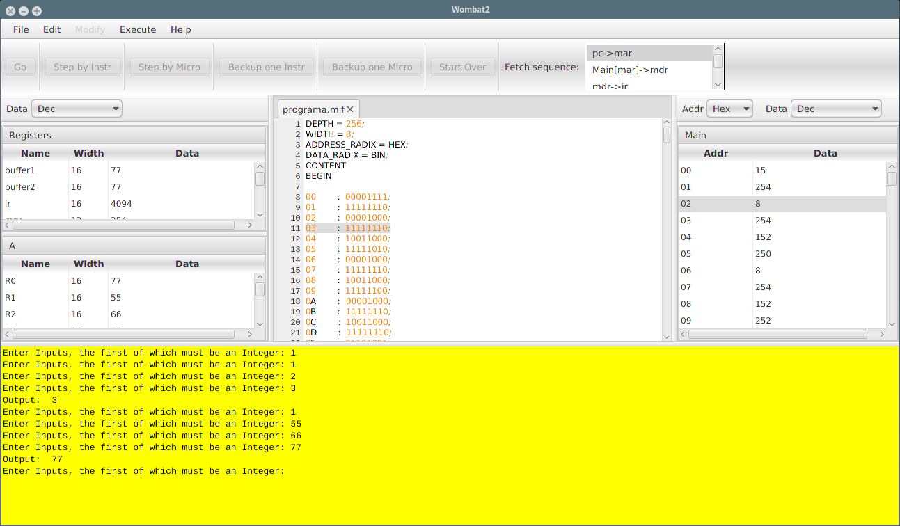
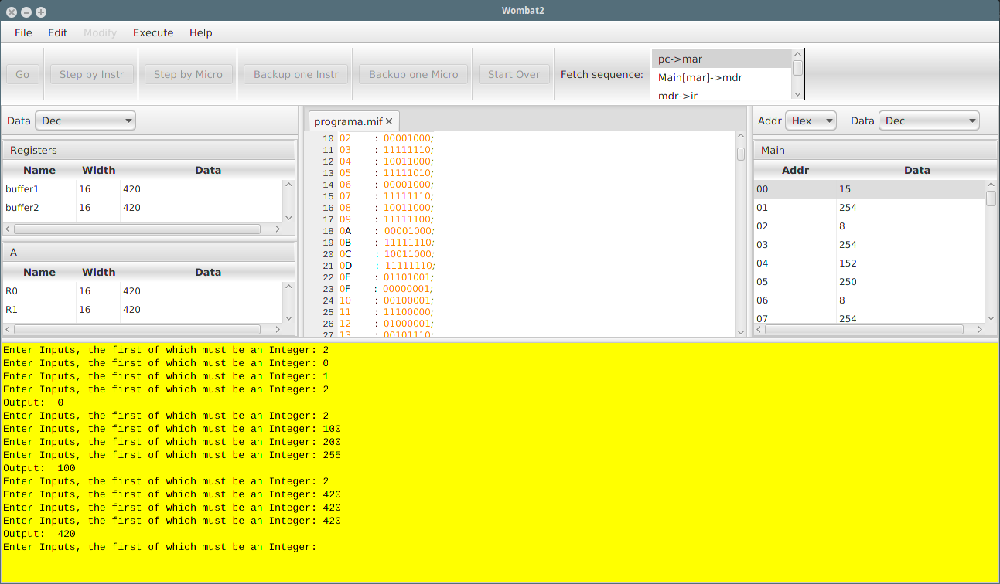
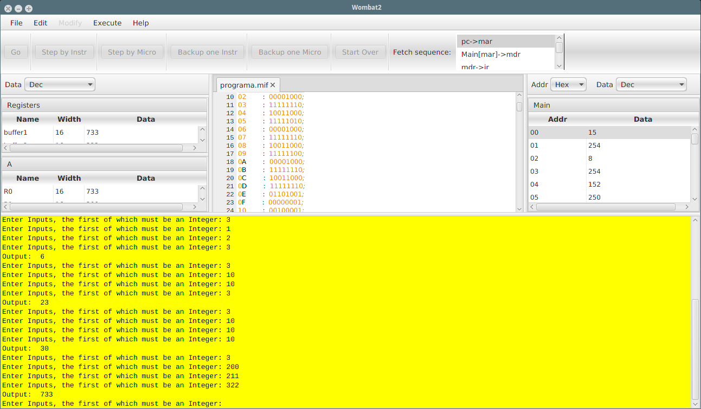
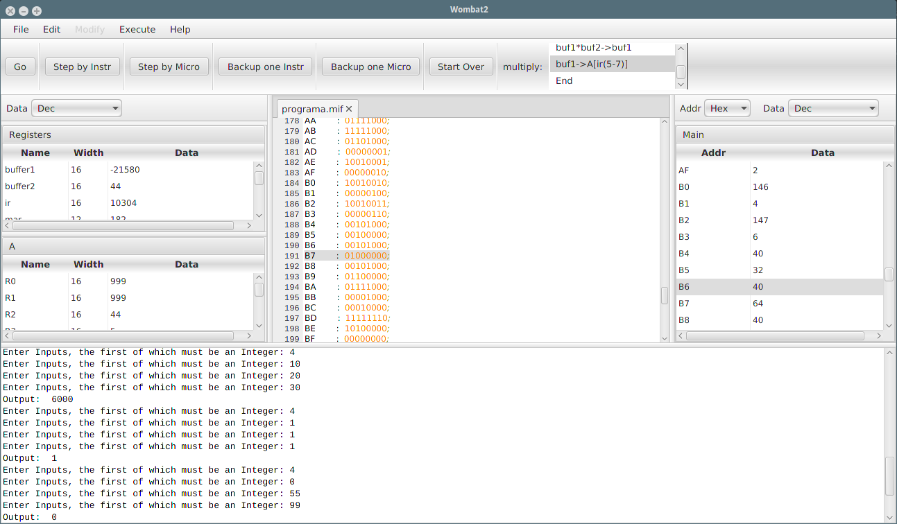
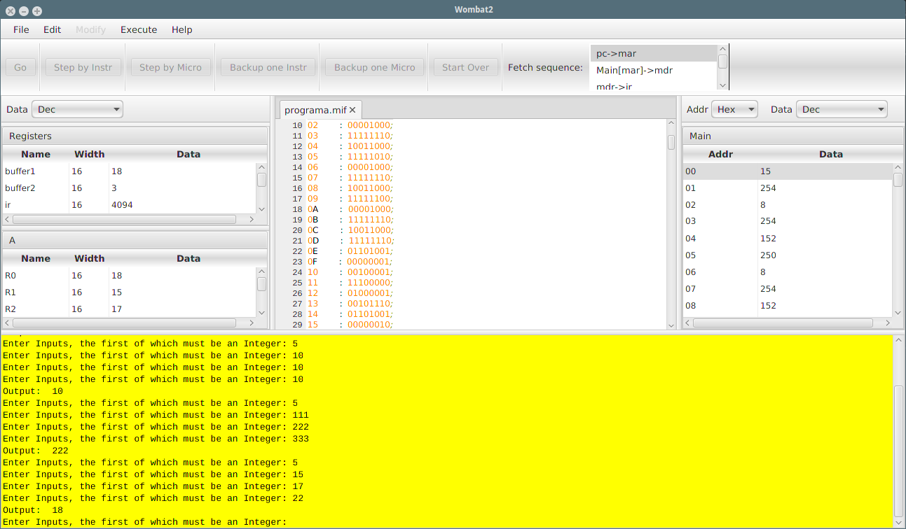

# Trabalho Prático 2 - Ligador

> Lucas Machado  
> Yuri Niitsuma  
> Nathalia Campos

### Introdução

O trabalho consiste em criar um *linker* para o *montador* do Wombat2 feito no [Trabalho Prático 1 (Github)][github_TP1].

[github_TP1]: https://github.com/ignitz/dcc008_tp1

### Assembler/Montador

#### Modificações

No Montador, tivemos que modificar as classes **SymbolTable** e **OpcodeTable** para prepará-lo para o ligador.

Primeiro adaptamos o **.extern** para guardar o símbolo com o valor de enrereço **0** e tipo **EXTERN** para diferenciar dos outros tipos de símbolos usados.  
Depois adicionamos o suporte para "*lembrar*" os usos do *labels* (\_label), *variáveis* (num) e *funções* (.extern).

Exemplo utilizando o `-v` (verbose) para imprimir a tabela de símbolos.

```
Symbol Table:
varLocal1  0x10  0x2  0x8
varLocal2  0x12  0x6
EXTERN:
funcao1  0x0  0x4
funcao2  0x0  0xa
```

Observe que **varLocal1** é um símbolo local e **funcao1** e **funcao2** são chamadas de funções.  
Todos os símbolos tem, no início, o endereço de referência e seguidos pelos endereços de onde ele foi utilizado.

No exemplo utilizado:

`varLocal1  0x10  0x2  0x8`
- `0x10` indica o valor a ser substituído na compilação.
- `0x2  0x8` endereços onde o símbolo foi utilizado

#### Arquivos de saída

Além do arquivo **MIF**, é gravado também o arquivo **SBTL** contendo a tabela de símbolos para o **Linker** utilizá-lo como informação.

```
Size: 0x10
varLocal1  0x10  0x2  0x8
varLocal2  0x12  0x6
EXTERN:
funcao1  0x0  0x4
funcao2  0x0  0xa
```

Utilizando o mesmo formato descrito na seção [Modificações](###Modificações) contendo **Size** que é o tamanho ocupado na RAM pelo módulo.

### Linker

#### Implementação

O linker foi implementado do seguinte modo.

- **SymbolTable**: De modo semelhante da classe utilizada no montador adaptado para o Linker, não reutilizei completamente o código pra não dar conflito.
- **Programa**: Classe que contém os arquivos "**MIF**" e "**SBTL**" e contém sua própria tabela de símbolos **locais** e **extern**.
- **Linker**: Classe que gerencia os programas:
  - **output**: Arquivo que vai ser o arquivo ligado e relocado.
  - **mainProg**: O módulo **Mif** principal, será alocado no endereço 0.
  - **modulos**: os módulos adicionais que serão juncionados para o programa **output**.
- **main.cpp**: Utilizado apenas para Instanciar a classe Linker, e utlizar os métodos para criar o arquivo **MIF** concatenado e atualizar os endereços.

O Linker utiliza o padrão de argumentos proposto na especificação, com um bônus de adicionar um modo verbose "**-v**".

```
linker programa.mif main modulo1 modulo2 ... moduloN [-v]
```

O linker lê todos os módulos (mif, sbtl) atualizando os endereços e concatenando no arquivo programa.mif (por padrão). Neste passo ele atualiza apenas as variáveis/label locais. Ou seja, tem um "escopo" utilizado em cada módulo podendo utilizar o nome da mesma variável em escopos diferentes.
Já os **EXTERN**'s são um caso a parte, pois eles são atualizados após o passo acima.

### Makefile

Utilizei o [GenericMakefile](https://github.com/mbcrawfo/GenericMakefile) como template de novo.


- **make**: Compila o linker. Reaproveita os arquivos "*.o*" que não foram modificado.

- **make clean**: Elimina todos os arquivos compilados.

- **make about**: Executa ./linker apenas para imprimir o *help*.
```
Ligador Wombat2

(C) 2016 Yuri Niitsuma <ignitzhjfk@gmail.com>
         Lucas Machado <lucaspedro.machado@gmail.com>
         Nathalia Campos <nathalia.campos.braga@gmail.com>

    Uso: linker programa.mif main modulo1 modulo2 ... moduloN [-v]
```
- **make ass**: Executa o montador para compilar os módulos dos arquivos .a.

- **make run**: Executa o montador normalmente nos arquivos de testes das **5 opções**.

- **make v**: Executa em modo verbose utilizando os arquivos do **run**. Imprime no terminal todo o processo da linkagem incluindo a tabela de símbolos atualizada após a relocação.

<!-- pagebreak -->
#### Executar diretamente

O linker pode ser executado diretamente no formato.  
`./linker NOME_ARQUIVO_SAIDA.mif MODULO_MAIN [MODULO1 .. MODULOn] [-v]`

Lembrando que o arquivo de saída tem extensão "mif" mas os módulos não.

Na compilação é necessária o uso do **c++11** pois utilizo uma funções presentes nesta versão. É compilado sem problemas no **Eufrates**, computador da graduação do **CRC**.

### Uso

Se encontra no [README.md](../src/linker/README.md) contido na pasta do **linker**.
Todos os testes foram *comprovados* na computador da graduação **Eufrates**.

### Testes

Segue o pseudo-código (C-like) para indicar o que o programa, depois de linkado, faz:
```c
while(true) {
  OP << entrada; // Recebe a operação
  // Entrada dos parâmetros A, B, C
  A << entrada;
  B << entrada;
  C << entrada;
  switch (OP) {
    case 1:
      max(A, B, C);
      break;
    case 2:
      min(A, B, C);
      break;
    case 3:
      sum(A, B, C);
      break;
    case 4:
      prod(A, B, C);
      break;
    case 5:
      media(A, B, C);
      break;
    default:
      exit();
  }
}
```

Seguem screenshots de testes no CPUSIM:

**OP é a operação a ser realizada.**
- Se OP = 1, o programa deverá apresentar o maior dos 3 números,


- Se OP = 2, o programa exibirá o menor dos 3,


<!-- pagebreak -->
- Se OP = 3, o programa exibirá a soma dos 3,


- Se OP = 4, o programa exibirá o produto dos 3,


<!-- pagebreak -->
- Se OP = 5, o programa exibirá a média dos 3,


- Para valores de OP diferentes de 1, 2, 3, 4 ou 5, o programa não fará nada.  
**Nesse caso ele da um jump pro comando exit**

Durante o desenvolvimento do linker utilizei os arquivos **tp2teste2main.a**, **tp2teste2calc.a** e **tp2teste2fact** disponibilizado pra testes no TP1 para usa-los neste TP.

**Ideia descartada:**
- Tivemos a ideia de dar suporte a pseudo istruções no .extern tal que faria a chamada **call** e **troca de contexto** dos 8 registradores mais o **RA** para dar suporte a recursão, etc. Mas desistimos de inserir pois com o programa teste das 5 opções não caberia nos 255 bytes da memória RAM pois o bloco da pilha (**sp**) encontraria rapidamente com o bloco do programa (semelhante ao **.text** do UNIX).

> Isso é tudo corretor. A qual é a boa de hoje é:
> - [Melhor jogo da mundial 2016 de League of Legends](https://www.youtube.com/watch?v=WAybE0ZmtPU) (Apesar do Samsung ter perdido)
> - [Black Mirror](https://www.netflix.com/title/70264888) (Sensacional)

<!-- pagebreak -->
### Referências

- [cplusplus Reference C++11](http://www.cplusplus.com/reference/)
- Organização Estruturada de Computadores - Andrew S. Tanenbaum (sexta edição)
- CPUSim Help em HTML que vem no pacote

<!-- ### Decisões (Aqui coloco minhas epifanias durante o desenvolvimento)

- Foi preciso modificar o **montador**:
  - para que ele guarde em um arquivo a tabela de símbolos e todas as posições da ocorrência para utilizar no linkador/ligador
  - Colocar no início do arquivo o tamanho do programa.
  - Ajuste para que o tamanho do programa sempre termine em um tamanho ímpar (ou par (depende da sua métrica)) **Isso farei no linkador**.
  - Inseri o comando para EXTERN (chamada de função call para um label externo). Não testei, tem que testar, não quero testar...
    - Fiz um teste bobo no **all.a**.
- Criei uma classe SymbolTable semelhante ao do Assembler para o Linker.
- Passos para o sucesso:
  - Abrir todos os módulos dicamicamente ✔.
  - Ler a tabela de símbolos ✔.
  - Atualizar tabelas dos símbolos ✔ (Mais ou menos)
  - Encontrar todas as ocorrências dos símbolos locais e atualizá-las ✔.
  - Encontrar todos os externs e atualizar na table symbol global ✔. -->
